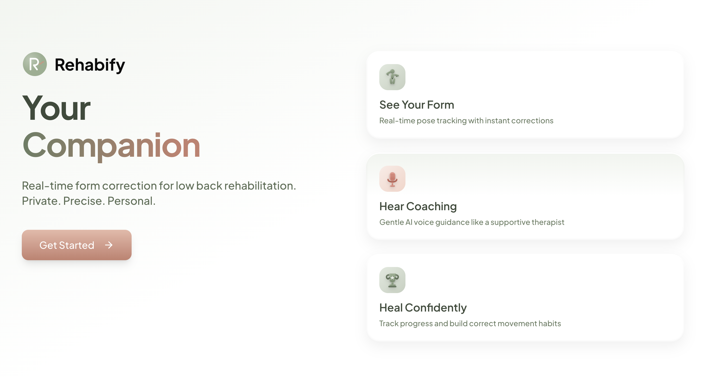
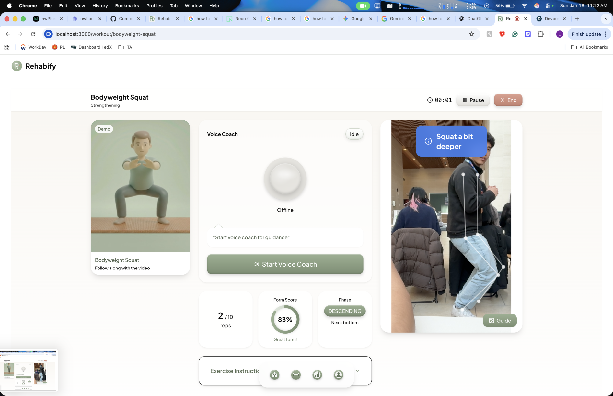
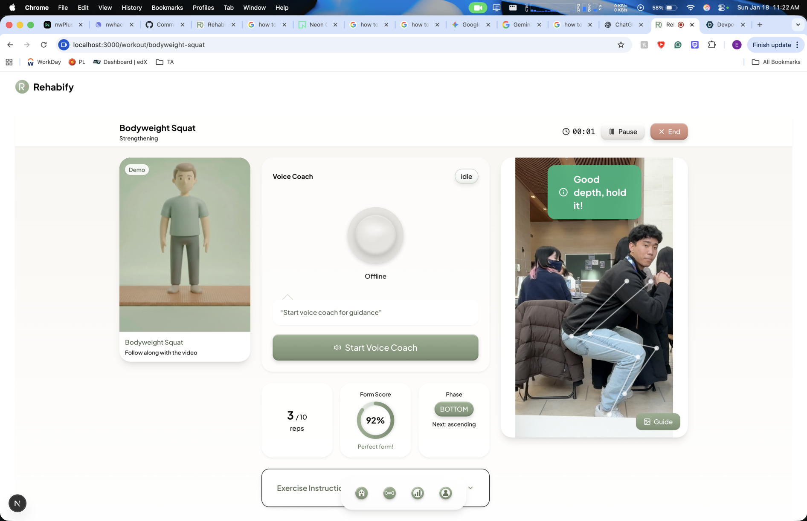

<div align="center">

# Rehabify

### AI-Powered Physical Therapy Coach with Real-Time Form Correction



[](https://nwhacks.io)
[](https://nextjs.org)
[](https://typescriptlang.org)
[](https://mediapipe.dev)

**Like having a physiotherapist in your living room**

[Demo](#demo) · [Features](#features) · [How It Works](#how-it-works) · [Tech Stack](#tech-stack) · [Quick Start](#quick-start)

</div>

---

## The Problem

After spending **$8K on physio bills**, waiting **3 weeks for my first appointment**, and only getting seen **once every 2 weeks** for a herniated disc, I realized the broken part of physical therapy isn't the clinic—it's what happens at home.

<div align="center">

| The Reality of Physical Therapy |
|:---:|
| **Only 35%** of patients complete their prescribed exercises |
| Patients are unsure if they're doing exercises correctly |
| Zero supervision between clinic visits |
| PTs have no visibility into home exercise quality |

</div>

## The Solution

Rehabify uses **computer vision + voice AI** to provide real-time form correction using just a webcam. Perform your exercises at home and get instant feedback like *"Keep your back straight"* or *"Lower those hips"*—transforming PT from opaque guesswork into data-driven care.

---

## Demo

<div align="center">

### Real-Time Form Correction in Action

| Poor Form Detection | Mid-Rep Coaching | Good Form Achieved |
|:---:|:---:|:---:|
|  |  |  |
| **15%** - "Sit back more, keep knees behind toes" | **83%** - "Squat a bit deeper" | **92%** - "Good depth, hold it!" |

### Lunge Form Analysis


</div>

---

## Features

### For Patients

- **Real-Time Form Correction** — AI watches your movement and provides instant voice feedback
- **Personalized Exercise Plans** — Guided assessment generates a tailored 12-week program using Gemini AI
- **Progress Tracking** — See your completion rates, form scores, and improvement over time
- **Privacy-First** — Video never leaves your device; all computer vision runs locally in your browser

### For Physical Therapists

- **Remote Monitoring Dashboard** — View patient completion rates, form quality scores, and problem areas
- **Data-Driven Insights** — Transform subjective patient reports into objective movement data
- **Safety Guardrails** — System detects serious symptoms and redirects patients to in-person care

### Safety & Compliance

- **Medical Safety Stops** — Serious symptoms (numbness, bowel issues, severe pain) trigger immediate redirection to professional care
- **HIPAA-Ready Architecture** — Built with healthcare data privacy in mind
- **Canadian Healthcare Compliant** — Designed for integration with Canadian healthcare systems

---

## How It Works

```
┌─────────────┐     ┌──────────────┐     ┌─────────────────┐     ┌─────────────┐
│   Webcam    │────▶│  MediaPipe   │────▶│ Form Detection  │────▶│  Voice AI   │
│   (30fps)   │     │    Pose      │     │    Engine       │     │   Coach     │
└─────────────┘     └──────────────┘     └─────────────────┘     └─────────────┘
                           │                      │                      │
                    33 body landmarks      Joint angle          "Lift those
                    (runs locally in       analysis &           hips up!"
                     WebAssembly)          rule-based           (< 1 sec
                                          validation            latency)
```

### The Pipeline

1. **Capture** — Webcam streams video at 30fps
2. **Detect** — MediaPipe Pose extracts 33 body landmarks in real-time (runs entirely in browser via WebAssembly)
3. **Analyze** — Custom algorithms evaluate joint angles, body alignment, and movement patterns
4. **Feedback** — Voice AI delivers natural coaching feedback in under 1 second

---

## Tech Stack

| Layer | Technology | Purpose |
|-------|------------|---------|
| **Frontend** | Next.js 15, React 19, Tailwind CSS | "Wellness sanctuary" design system |
| **Computer Vision** | MediaPipe Pose (WASM + Web Workers) | Real-time skeleton tracking |
| **Voice AI** | Vapi (Deepgram STT + Gemini + ElevenLabs TTS) | Natural coaching feedback |
| **Database** | Neon PostgreSQL + Drizzle ORM | User data & exercise tracking |
| **AI/ML** | Google Gemini API | Personalized plan generation |
| **Deployment** | Vercel | Edge-optimized hosting |

---

## Quick Start

### Prerequisites

- Node.js 18+
- pnpm
- PostgreSQL database (we use [Neon](https://neon.tech))

### Installation

```bash
# Clone the repository
git clone https://github.com/yourusername/rehabify.git
cd rehabify

# Install dependencies
pnpm install

# Set up environment variables
cp .env.example .env.local
# Add your API keys (Neon, Vapi, Gemini)

# Initialize database
npx drizzle-kit push

# Start development server
pnpm dev
```

Visit `http://localhost:3000` to see the app.

### Testing

```bash
pnpm test           # Run all tests
pnpm test:watch     # Watch mode
pnpm test:e2e       # Playwright E2E tests
pnpm test:coverage  # Coverage report
```

---

## Exercise Support

| Tier | Exercises | Capabilities |
|:----:|-----------|--------------|
| **Tier 1** | Cat-Camel, Cobra, Dead Bug, Glute Bridge, Bodyweight Squat | Full AI form detection with real-time feedback |
| **Tier 2** | 47+ additional exercises | Voice-guided with reference videos |

All exercises sourced from licensed PT resources and validated for safety.

---

## Project Structure

```
rehabify/
├── plan/                    # Detailed specs and architecture docs
│   ├── 00-architecture/     # System design, data flow
│   ├── 01-backend/          # Database, API routes
│   ├── 02-frontend/         # Components, wireframes
│   ├── 03-vision/           # MediaPipe, form detection rules
│   ├── 04-voice-ai/         # Vapi integration, prompts
│   └── 05-contingencies/    # Scope reduction plans
│
├── src/
│   ├── app/                 # Next.js App Router pages
│   ├── components/          # React components
│   ├── lib/                 # Vision, voice, database utilities
│   │   ├── mediapipe/       # Pose detection & form analysis
│   │   ├── vapi/            # Voice AI integration
│   │   └── gemini/          # Plan generation
│   └── stores/              # Zustand state management
│
└── public/
    ├── videos/              # Exercise demo videos
    └── exercise-images/     # Exercise reference images
```

---

## What We Learned

- **MediaPipe Pose** is incredibly powerful but requires careful tuning for different body types
- **Voice AI** has come far—Gemini can give nuanced coaching feedback that feels human
- **Privacy-first architecture** is possible AND performant with modern browser APIs
- **Next.js 15** App Router + React Server Components are perfect for healthcare apps with mixed public/private data

---

## What's Next

- [ ] Expand from 5 to 52 exercises (full PT library)
- [ ] Mobile app (React Native) for better camera angles
- [ ] PT onboarding flow for custom exercise plans
- [ ] Machine learning for personalized form validation
- [ ] Progress prediction: *"73% likely to recover in 4 weeks"*
- [ ] Insurance integration (CPT code 98975)
- [ ] Clinical trials with UBC PT department

---

## The Vision

Physical therapy shouldn't require proximity to an expensive clinic. It should be something you can do confidently at home, with real-time guidance and professional oversight.

**Rehabify is the infrastructure to make that happen.**

---

<div align="center">

### Built with care at nwHacks 2026

*Because everyone deserves access to quality physical therapy*

</div>
