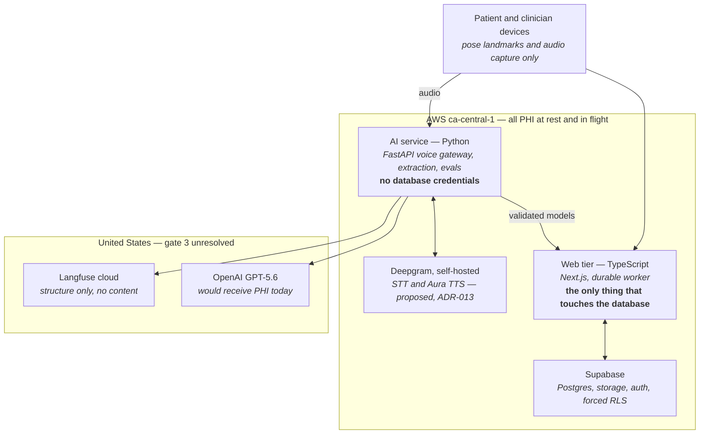
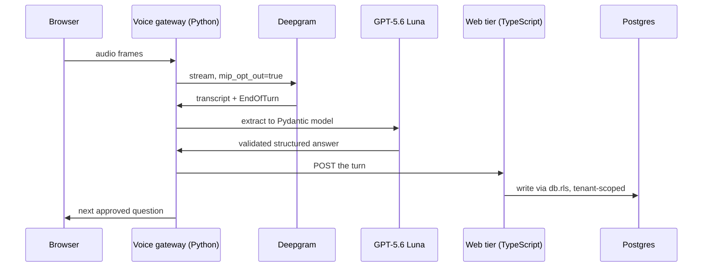

# 11 — Diagrams

> The rest of this set describes the system in prose, organised by layer. This
> document draws it, organised by what an implementer actually needs to see:
> where things live, what happens on the busiest path, and what gets recorded.
>
> Mermaid rather than image files, so the diagrams diff like code and stay
> correct when the docs change.

---

## 1. Where everything lives

The single most consequential fact in this architecture is which side of a border
each component sits on. Everything in [03](./03-data-architecture.md),
[05](./05-voice-pipeline.md), and [06](./06-ai-pipelines.md) is downstream of it.



Three things this shows by omission:

- **No arrow from the device to any vendor.** Every third-party call is proxied
  through our own tiers. That is what keeps transcript and extraction inside the
  PHI boundary — today, extraction runs on the *client* and writes to Zustand
  ([02 §5](./02-current-state.md)).
- **No arrow from the Python service to Supabase.** That absence is the security
  boundary ([ADR-016](./09-decision-log.md#adr-016)): the AI service returns
  validated models and the web tier persists them, so every write passes the
  `db.rls` guard in [03 §4](./03-data-architecture.md). Adding that arrow to save a
  round trip would quietly delete the guarantee.
- **Vision does not appear at all**, because the pose pipeline runs entirely in
  the browser and never uploads video. What reaches a server is landmark
  confidence, joint angles, and rep counts — numbers, not imagery. It is also out
  of scope for the first vertical slice ([ADR-015](./09-decision-log.md#adr-015)).

The red zone is the whole of gate 3 ([08 §4](./08-migration-plan.md)). If Canadian
LLM residency is required, `oai` moves into `ca` behind the same adapter and
loses the GPT-5.6 tiering ([ADR-008](./09-decision-log.md#adr-008)).

---

## 2. One turn of a voice intake

The busiest path in the system, and the first vertical slice.



**The last message carries the authority boundary.** The next question is selected
by the intake question graph *in code*. The model phrases an already-approved
question and never chooses one — [01](./01-product-definition.md). This is also
why LangGraph was rejected: it exists to let the model route
([ADR-016](./09-decision-log.md#adr-016)).

**The gateway does not write to Postgres**, and the hop through the web tier is
not incidental — it is what keeps the database behind one boundary. It also runs
*off* the reply path: the next question can go back to the browser without waiting
on the write.

**There is no TTS message**, because the approved question set is pre-rendered
audio. That is not a cost optimisation: Aura's 45-concurrent-stream ceiling is
lower than STT's 150, so TTS is the system's binding capacity constraint and
pre-rendering removes it ([05](./05-voice-pipeline.md)).

Failure modes not drawn here — `last_word_end === -1`, reconnection, keep-alives,
barge-in — are in [05](./05-voice-pipeline.md) and are most of the real work in
stage 7.

---

## 3. What gets recorded, and where it goes

```mermaid
flowchart TB
    call["One model call"]

    call --> pg["<b>Postgres, ca-central-1</b><br/>source of truth · full clinical detail<br/>GenerationJob → ModelRun → AIArtifact → AuditEvent<br/><i>never leaves the region</i>"]
    call --> prod["<b>Langfuse, production project</b><br/>structure only · tokens, latency, rule ids<br/>prompt version, schema verdict<br/><i>zero patient text</i>"]
    call --> ev["<b>Langfuse, eval project</b><br/>full content · prompts, outputs, judge reasoning<br/>separate credentials<br/><i>synthetic cases only</i>"]
```

**Never sent anywhere:** patient narrative, `SourceReference` citations, and any
`gen_ai.*` attribute. A CI test fails the build if one appears
([06 §3](./06-ai-pipelines.md)).

**Postgres is the source of truth; Langfuse is a lens.** If Langfuse is
unavailable, nothing clinical is lost. This is why "how do we capture the data" is
a schema question rather than a telemetry question.

The two Langfuse boxes are two projects with separate credentials, not one project
with a flag. Production does not hold the eval key and therefore cannot write
content to it regardless of program state ([08 §3a](./08-migration-plan.md)).

### The one quality signal that survives the contract

The authority boundary already forces a physiotherapist to approve every plan
before it publishes. **The diff between what the model generated and what the
clinician approved is a continuous, real-traffic measure of plan quality** — and
it is a *number*, so it crosses the no-PHI boundary intact and can be scored in
the production project.

It costs almost nothing and it is the only real-patient accuracy signal in the
design. It exists only if stage 8 instruments it, which is why it belongs here and
not in a retrospective.

---

## Maintaining these

Update a diagram in the same commit as the doc it contradicts. All three encode
decisions that are still open — ADR-008, ADR-010, ADR-013 — and a diagram that
outlives its decision is worse than no diagram.
